# **Panaderia**
## **Contexto**

Se trata de hacer una aplicacion para gestionar las funciones propias de un panadero. La aplicacion es exclusiva para el panadero donde le ayudara a llevar un registro de las acciones que realiza.La aplicacion le permitira al panadero realizar los siguientes casos de uso:
* Comprar pan: En este caso de uso, el panadero podra registrar las compras que realiza. Primero se le preguntara si quiere registrar un cliente nuevo o seleccionar una cliente habitual ya registrado. Despues de eso, se mostrara un menu con los tipos de panes que puede seleccionar y la cantidad de cada pan que deseea comprar. Por ultimo, le dara la posibilidad de si el cliente quiere pagar ahora o mas tarde.
* Pagar Pendientes: En esta funcionalidad, el panadero podra seleccionar el cliente al que se le cobraran las deudas. Despues, se mostrara una lista con todas las deudas del cliente y el panadero podra seleccionar que deuda cobrar al cliente.
* Rellenar Almacen: Aqui el panadero podra aumentar la cantidad de panes que tiene en el almacen. Se mostrara una lista para seleccionar el pan que quiere rellenar y, despues, el panadero insertara la cantidad.
* Historial de Compras: aqui se mostrar una lista con todo el historial de compras hechas hasta el momento. Se mostrara un titulo con la fecha y el nombre del cliente que hizo la compra y, a continuacion, una lista de los panes que iban incluidos en esa compra.
* Historial de Pendientes: lo mismo que la funcionalidad del historial de compras, pero mopstrando las compras que todavia no hayan sido pagadas.  
* Visualizar Almacen: aqui el pandero pordra ver una lista de los panes que tiene en el almacen y su cantidad.

## **Diseño**

La estructura de la aplicacion se divide en 4 partes o paquetes. Ademas, la aplicacion dispondra de 4 archivos CSV donde se almacenaran datos: Un csv llamado Historial que contiene el historial de compras, otro llamado pendientes que contiene las compras realizadas pero no pagadas, uno del almacen con informacion sobre los tipos de panes, cantidad y precio, y, por ultimo, otro de clientes con informacion de los clientes registrados en la aplicacion.

En cuanto a la estructura, la app se divide en estos cuatro paquetes:

### *Consola*
* Program: en esta clase se ejecuta el metodo main que iniciara el programa. El metodo creara los gestores, la vista y un controlador al que iniciara.
* Controlador: aqui se encuentran los metodos de los casos de uso que realizara la aplicacion. El constructor de la clase crea el menu de que se le mostrar al panadero nada mas iniciar la app.
* Vista: esta clase contiene todos los metodos que gestionan la interfaz que se le mustra al panadero y con la que va a interactuar.

### *App*
Aqui se encuentran las clases que gestionaran los metodos para modificar los CSV.
* GestorDeAlmacenCSV: aqui se encuentran los metodos para gestionar el almcenamiento de datos del almacen. Por ejemplo, restar una cantidad de pan, sumar otra cantidad de pan ...
* GestorDeClienteCSV: en esta clase estan los metodos para añadir un cliente al CVS, eliminar un cliente, devolver un cliente, busca un cliente...
* GestorDeHistorialCSV: aqui se encuntra unicamente un metodo para añadir una nueva compra al historial.
* GestorDePendientesCSV: aqui se encuentran lso metodos para gestionar el historial de pendientes. Ademas de añadir una nueva compra al historial, cuando esa compra haya sido pagada se llamara al metodo BorrarRegistro donde se borrar esa compra del historial de pendientes. Aparete, contiene otros metodos como devolver una listado de compras pendientes...

Ademas, la clases en su contructor instanciara una clase del paquete Data donde ejecutaran la operacion de leer el archivo CSV. Los datos se guardaran en una Lista donde se realizaran todas las modificaciones.

### *Data*

En esta paquete, estan las clases que se conectan directamentes al CSV, una por cada CSV. El namespace tiene una interfaz IData con los metodos guardar y leer desde donde heredaran el resto de clases. Las clases tendran un atributo string con la url donde esta ubicado el CSV.
El metodo guardar transcribe la informacion que se le pasa en una lista a un string que se guarda en el archivo. Un string por cada linea de la lista. El metodo leer lee el archivo CSV y guarda cada linea en una lista que se devolvera como salida.

## **Diagramas**

### **Casos de uso: Modelo de negocio**
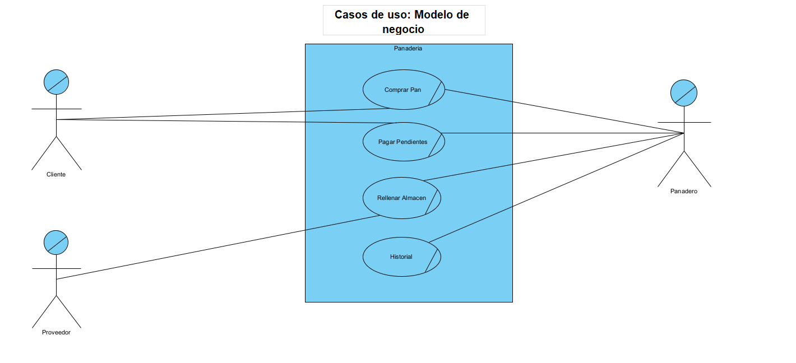
### **Casos de uso: Sistema**
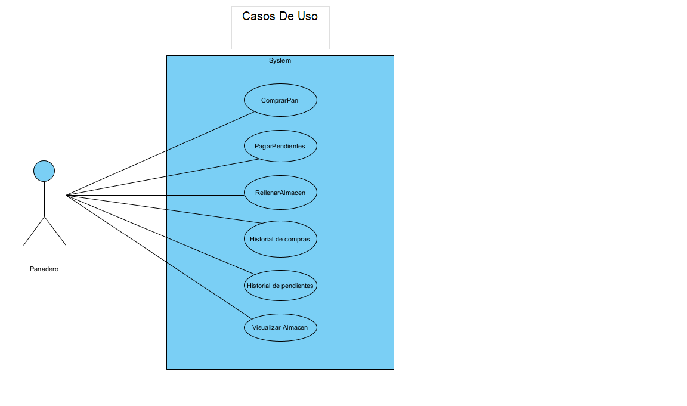
### **Diagrama de Estado**
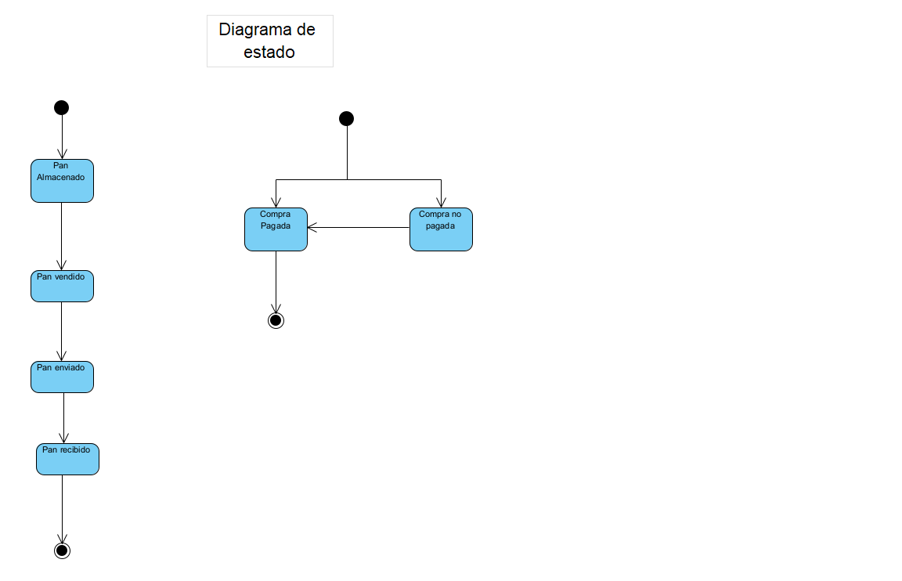
### **Diagrama de Actividad**

### **Diagrama de secuencia**

### **Diagrama de clases: modelo de negocio**

### **Diagrama de clases: sistema**

## **Pruebas**

## **Menu principal**
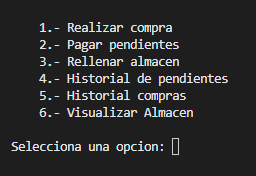
## **Realizar Compra**
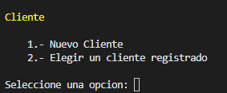

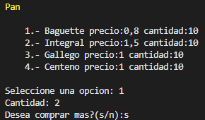

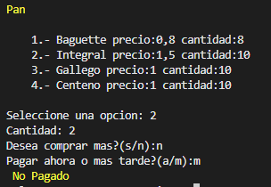
## **Pagar Pendientes**
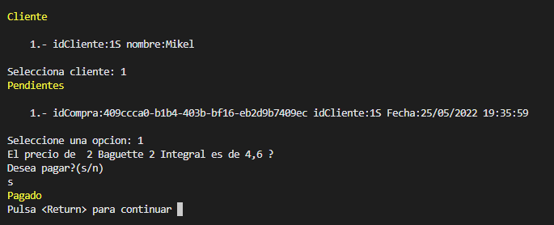
## **Historial Pendientes**
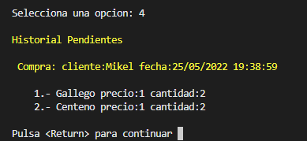
## **Historial Compras**
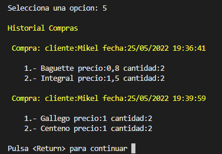
## **Rellenar Almacen**
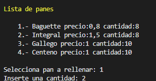

## **Conclusion**

El proyecto ha tenido ciertas complicaciones que ha habido que resolver. Tambien, he dispuesto de menos tiempo para realizarlo (causa de otros proyectos a realizar), por tanto, no estoy muy satisfecho con la implementacion de algunos metodos o formas de estructurar el programa que podrian haber sido mas eficientes.

Puntos o problemas a tener en cuenta:
* Cuando se realizan compras que contienen mas de un tipo de pan, he tenido que crear una lista en cada compra para guardar todos los tipos de pan que se compran. Sin embargo, a la hora de guardar la compra en el CSV, se guarda cada pan comprado como una linea. Por tanto, cuando se vuelve a leer el CSV se reordenan todos los panes de una compra en un sola lista de compra.
* Para la implementacion del codigo de la compra, he utilizado una clase lamada GUid que genera codigos aleatorios.
* Para guardar la informacion de cantidad de panes, he creado una variable entera dentro de la clase pan. Esta variable sirve tanto para guardar el numero de panes que se compran como para guardar el numero de panes alamcenados en el almacen.
